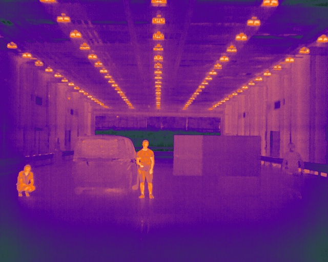
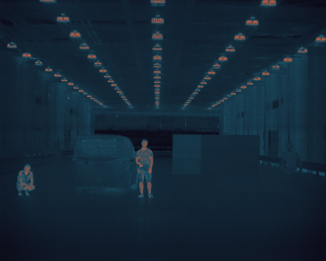
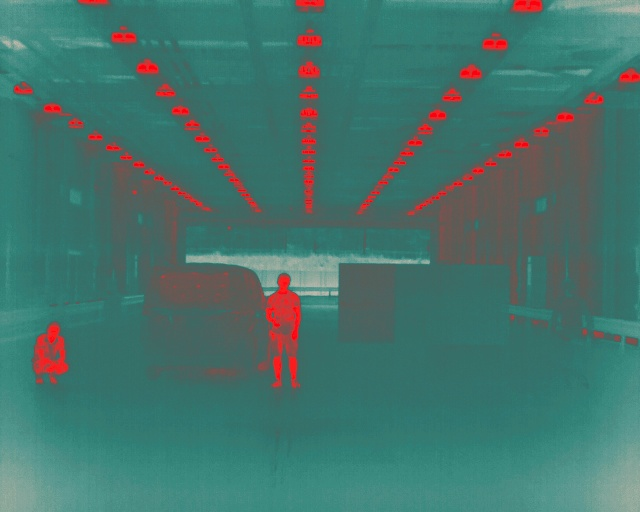
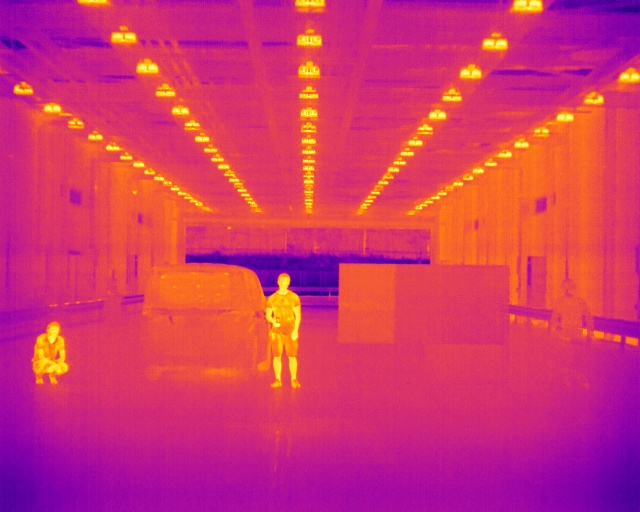
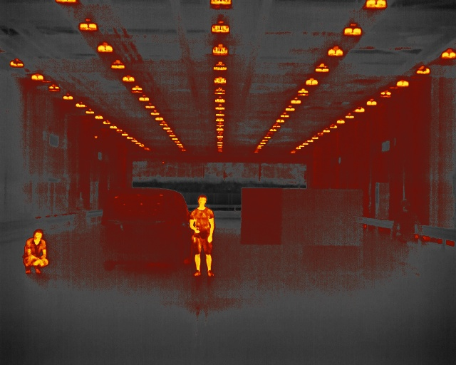
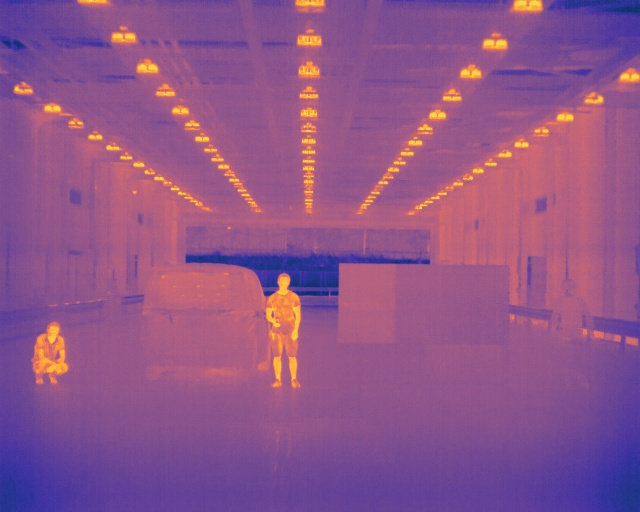

# Thermal to Color

Changes a gray scale thermal image to color using a defined palette.

Eample input image:


Output images using different palettes:

<table>
	<tr>
		<td>  </td>
		<td>  </td>
	</tr>
	<tr>
		<td>  </td>
		<td>  </td>
	</tr>
	<tr>
		<td>  </td>
		<td>  </td>
	</tr>
</table>

## Credits
- Blackbody color palette comes from Mitchell N. Charity [project](http://www.vendian.org/mncharity/)
- Gray Red color palette was proposed by Maria João Sousa, Alexandra Moutinho, and Miguel Almeida. "Thermal Infrared Sensing for Near Real-Time Data-Driven Fire Detection and Monitoring Systems", MDPI Sensors 20(3), 2020. [paper](https://www.mdpi.com/1424-8220/20/23/6803/htm)
- Several palette files come from the palette archive at [CPY-City](http://soliton.vm.bytemark.co.uk/pub/cpt-city/)
- CPT file loading based on Jonas [pycpt](https://github.com/j08lue/pycpt/blob/master/pycpt/load.py)

## Install
```
mkdir <ROS-WORKSPACE>/thermal2color/src -p
cd <ROS-WORKSPACE>/thermal2color/src
git clone <THIS-CODE-REPOSITORY>
cd ../
catkin build  # <-- you can also use: colcon build --cmake-args -DCMAKE_BUILD_TYPE=Release
```


## Usage
```
cd src/thermal2color/scripts
python  thermal2color thermal2color.py _image:=<INPUT_IMAGE_TOPIC> _palette:=<SOME_PALETTE_NAME> 
```

Available arguments are as follows:
- **image** Name of the input image topic, default "/image_raw"
- **palette** Name of the color palette name to use, default "cequal". Several palette CPT files, like ironbow, magma, grayred, and so on, useful for thermal imaging, are included.
- **xmin** Minimum X coordinate to define a ROI, default: np.NaN which means 0
- **xmax** Maximum X coordinate to define a ROI, default: np.NaN which means the image width
- **ymin** Minimum Y coordinate to define a ROI, default: np.NaN which means 0
- **ymax** Maximum Y coordinate to define a ROI, default: np.NaN which means the image height

The output image topic is defined by appending "\_gray2color" to the input image topic. 

You can visualize the output image using RVIZ or using "rosrun image_view image_view image:=<INPUT_IMAGE_TOPIC>_gray2color". 

## TODO 
- [ ] Support getting the palette from a regular file. Code to extract a palette from a file is also included, but the program only accepts CPT palettes.
- [ ] This code has been only tested with FLIR/Teledyne ADK thermal images. Testing images from other sensors is necessary.
- [ ] The input is assumed to be gray scale, there maybe other thermal image formats we can support.